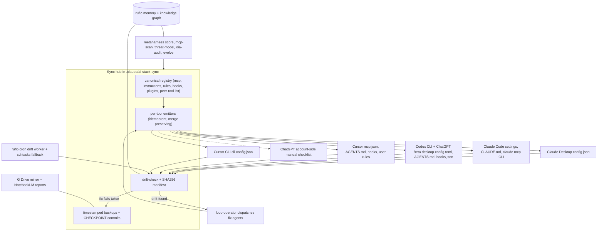

# Chat Export - System settings synchronization plan

- **Conversation ID:** `66856fed-70f3-49f4-b6d4-534da6309648`
- **Exported:** 2026-08-14 19:10:16
- **Source:** agent transcript JSONL

---

## User

<manually_attached_skills>
The user has manually attached the following skills to their message.
These skills contain specific instructions or workflows that the user wants you to follow for this request.
Only read the files if needed, the full skill content is inlined here.

Skill Name: init-project
Path: c:\Users\JeremyWilliams\.cursor\plugins\cache\ruflo\ruflo-core\a0c1ac4b4ff84360cb85b577e1da81eb661a078f\skills\init-project\SKILL.md
SKILL.md content:
Run `npx @claude-flow/cli@latest init --wizard` to set up the project interactively, or `npx @claude-flow/cli@latest init --preset standard` for defaults.

This creates CLAUDE.md, .claude/settings.json, and .claude-flow/ config with MCP server registration for the `ruflo` MCP tools.

---

Skill Name: research-synthesize
Path: c:\Users\JeremyWilliams\.cursor\plugins\cache\ruflo\ruflo-goals\a0c1ac4b4ff84360cb85b577e1da81eb661a078f\skills\research-synthesize\SKILL.md
SKILL.md content:
# Research Synthesize

Synthesize accumulated research findings into actionable reports.

## When to use

After running deep-research (one or multiple times), when you need to pull together findings from memory into a coherent synthesis with recommendations.

## Steps

1. **Gather findings** — search across research namespaces:
   - `mcp__claude-flow__memory_search` namespace `research` for raw findings
   - `mcp__claude-flow__memory_search` namespace `research-sources` for references
   - `mcp__claude-flow__agentdb_pattern-search` for discovered patterns
   - `mcp__claude-flow__agentdb_context-synthesize` for AI-assisted context building
2. **Grade evidence** — for each finding, assess:
   - **High**: Multiple independent sources agree, directly observed, reproducible
   - **Medium**: Single credible source, indirectly supported, plausible
   - **Low**: Anecdotal, single unverified source, speculative
3. **Resolve contradictions** — when findings conflict:
   - Identify the specific claim in tension
   - Compare evidence quality
   - Check recency (newer data may supersede)
   - Note unresolved contradictions explicitly
4. **Predict relevance** — call `mcp__claude-flow__neural_predict` to score which findings are most relevant to the original goal
5. **Structure report**:
   - Executive summary (2-3 sentences answering the original question)
   - Key findings (ranked by evidence quality)
   - Methodology (what sources were checked)
   - Limitations (what wasn't checked, what remains uncertain)
   - Recommendations (concrete next actions)
   - References (source links and memory keys)
6. **Store synthesis** — call `mcp__claude-flow__memory_store` namespace `research-synthesis` with the full report

## Output format

```
# [Research Topic] — Synthesis Report

## Summary
[2-3 sentence answer]

## Key Findings
1. [Finding] — Evidence: High/Medium/Low
2. [Finding] — Evidence: High/Medium/Low

## Contradictions
- [Claim A] vs [Claim B]: [resolution or "unresolved"]

## Recommendations
1. [Action] — because [reasoning]

## Sources
- [key]: [description]
```

---

Skill Name: agent-development
Path: c:\Users\JeremyWilliams\.cursor\plugins\cache\claude-plugins-official\plugin-dev\d68033bd1a2574262d66b410f3dc1a44e3e70d13\skills\agent-development\SKILL.md
SKILL.md content:
# Agent Development for Claude Code Plugins

## Overview

Agents are autonomous subprocesses that handle complex, multi-step tasks independently. Understanding agent structure, triggering conditions, and system prompt design enables creating powerful autonomous capabilities.

**Key concepts:**
- Agents are FOR autonomous work, commands are FOR user-initiated actions
- Markdown file format with YAML frontmatter
- Triggering via description field with examples
- System prompt defines agent behavior
- Model and color customization

## Agent File Structure

### Complete Format

```markdown
---
name: agent-identifier
description: Use this agent when [triggering conditions]. Typical triggers include [scenario 1 in prose], [scenario 2 in prose], and [scenario 3 in prose]. See "When to invoke" in the agent body for worked scenarios.
model: inherit
color: blue
tools: ["Read", "Write", "Grep"]
---

You are [agent role description]...

## When to invoke

[Two to four representative scenarios written as prose, e.g.:]
- **[Scenario name].** [What the situation looks like and what the agent should do.]
- **[Scenario name].** [Same.]

**Your Core Responsibilities:**
1. [Responsibility 1]
2. [Responsibility 2]

**Analysis Process:**
[Step-by-step workflow]

**Output Format:**
[What to return]
```

## Frontmatter Fields

### name (required)

Agent identifier used for namespacing and invocation.

**Format:** lowercase, numbers, hyphens only
**Length:** 3-50 characters
**Pattern:** Must start and end with alphanumeric

**Good examples:**
- `code-reviewer`
- `test-generator`
- `api-docs-writer`
- `security-analyzer`

**Bad examples:**
- `helper` (too generic)
- `-agent-` (starts/ends with hyphen)
- `my_agent` (underscores not allowed)
- `ag` (too short, < 3 chars)

### description (required)

Defines when Claude should trigger this agent. **This is the most critical field** — it is loaded into context whenever the agent is registered, so the harness can decide when to dispatch.

**Must include:**
1. Triggering conditions ("Use this agent when...")
2. A short prose summary of the typical trigger scenarios
3. A pointer to a "When to invoke" section in the agent body for the detailed worked scenarios

**Format:**
```
Use this agent when [conditions]. Typical triggers include [scenario 1 in prose], [scenario 2 in prose], and [scenario 3 in prose]. See "When to invoke" in the agent body for worked scenarios.
```

**Best practices:**
- Name 2-4 trigger scenarios in the prose summary
- Cover both proactive (assistant invokes itself) and reactive (user requests) triggering
- Cover different phrasings of the same intent
- Be specific about when NOT to use the agent
- Put detailed scenarios in the body under "When to invoke" as a bullet list of prose descriptions

### model (required)

Which model the agent should use.

**Options:**
- `inherit` - Use same model as parent (recommended)
- `sonnet` - Claude Sonnet (balanced)
- `opus` - Claude Opus (most capable, expensive)
- `haiku` - Claude Haiku (fast, cheap)

**Recommendation:** Use `inherit` unless agent needs specific model capabilities.

### color (required)

Visual identifier for agent in UI.

**Options:** `blue`, `cyan`, `green`, `yellow`, `magenta`, `red`

**Guidelines:**
- Choose distinct colors for different agents in same plugin
- Use consistent colors for similar agent types
- Blue/cyan: Analysis, review
- Green: Success-oriented tasks
- Yellow: Caution, validation
- Red: Critical, security
- Magenta: Creative, generation

### tools (optional)

Restrict agent to specific tools.

**Format:** Array of tool names

```yaml
tools: ["Read", "Write", "Grep", "Bash"]
```

**Default:** If omitted, agent has access to all tools

**Best practice:** Limit tools to minimum needed (principle of least privilege)

**Common tool sets:**
- Read-only analysis: `["Read", "Grep", "Glob"]`
- Code generation: `["Read", "Write", "Grep"]`
- Testing: `["Read", "Bash", "Grep"]`
- Full access: Omit field or use `["*"]`

## System Prompt Design

The markdown body becomes the agent's system prompt. Write in second person, addressing the agent directly.

### Structure

**Standard template:**
```markdown
You are [role] specializing in [domain].

**Your Core Responsibilities:**
1. [Primary responsibility]
2. [Secondary responsibility]
3. [Additional responsibilities...]

**Analysis Process:**
1. [Step one]
2. [Step two]
3. [Step three]
[...]

**Quality Standards:**
- [Standard 1]
- [Standard 2]

**Output Format:**
Provide results in this format:
- [What to include]
- [How to structure]

**Edge Cases:**
Handle these situations:
- [Edge case 1]: [How to handle]
- [Edge case 2]: [How to handle]
```

### Best Practices

✅ **DO:**
- Write in second person ("You are...", "You will...")
- Be specific about responsibilities
- Provide step-by-step process
- Define output format
- Include quality standards
- Address edge cases
- Keep under 10,000 characters

❌ **DON'T:**
- Write in first person ("I am...", "I will...")
- Be vague or generic
- Omit process steps
- Leave output format undefined
- Skip quality guidance
- Ignore error cases

## Creating Agents

### Method 1: AI-Assisted Generation

Use this prompt pattern (extracted from Claude Code):

```
Create an agent configuration based on this request: "[YOUR DESCRIPTION]"

Requirements:
1. Extract core intent and responsibilities
2. Design expert persona for the domain
3. Create comprehensive system prompt with:
   - Clear behavioral boundaries
   - Specific methodologies
   - Edge case handling
   - Output format
   - A "When to invoke" section listing 2-4 trigger scenarios as prose bullets
4. Create identifier (lowercase, hyphens, 3-50 chars)
5. Write description with triggering conditions and a short prose summary of trigger scenarios

Return JSON with:
{
  "identifier": "agent-name",
  "whenToUse": "Use this agent when... Typical triggers include [...]. See \"When to invoke\" in the agent body.",
  "systemPrompt": "You are..."
}
```

Then convert to agent file format with frontmatter.

See `examples/agent-creation-prompt.md` for complete template.

### Method 2: Manual Creation

1. Choose agent identifier (3-50 chars, lowercase, hyphens)
2. Write description with examples
3. Select model (usually `inherit`)
4. Choose color for visual identification
5. Define tools (if restricting access)
6. Write system prompt with structure above
7. Save as `agents/agent-name.md`

## Validation Rules

### Identifier Validation

```
✅ Valid: code-reviewer, test-gen, api-analyzer-v2
❌ Invalid: ag (too short), -start (starts with hyphen), my_agent (underscore)
```

**Rules:**
- 3-50 characters
- Lowercase letters, numbers, hyphens only
- Must start and end with alphanumeric
- No underscores, spaces, or special characters

### Description Validation

**Length:** 10-5,000 characters
**Must include:** Triggering conditions and examples
**Best:** 200-1,000 characters with 2-4 examples

### System Prompt Validation

**Length:** 20-10,000 characters
**Best:** 500-3,000 characters
**Structure:** Clear responsibilities, process, output format

## Agent Organization

### Plugin Agents Directory

```
plugin-name/
└── agents/
    ├── analyzer.md
    ├── reviewer.md
    └── generator.md
```

All `.md` files in `agents/` are auto-discovered.

### Namespacing

Agents are namespaced automatically:
- Single plugin: `agent-name`
- With subdirectories: `plugin:subdir:agent-name`

## Testing Agents

### Test Triggering

Create test scenarios to verify agent triggers correctly:

1. Write agent with specific triggering examples
2. Use similar phrasing to examples in test
3. Check Claude loads the agent
4. Verify agent provides expected functionality

### Test System Prompt

Ensure system prompt is complete:

1. Give agent typical task
2. Check it follows process steps
3. Verify output format is correct
4. Test edge cases mentioned in prompt
5. Confirm quality standards are met

## Quick Reference

### Minimal Agent

```markdown
---
name: simple-agent
description: Use this agent when [condition]. Typical triggers include [trigger 1] and [trigger 2]. See "When to invoke" in the agent body.
model: inherit
color: blue
---

You are an agent that [does X].

## When to invoke

- **[Scenario A].** [Description.]
- **[Scenario B].** [Description.]

Process:
1. [Step 1]
2. [Step 2]

Output: [What to provide]
```

### Frontmatter Fields Summary

| Field | Required | Format | Example |
|-------|----------|--------|---------|
| name | Yes | lowercase-hyphens | code-reviewer |
| description | Yes | Prose triggers | Use when... Typical triggers include... |
| model | Yes | inherit/sonnet/opus/haiku | inherit |
| color | Yes | Color name | blue |
| tools | No | Array of tool names | ["Read", "Grep"] |

### Best Practices

**DO:**
- ✅ Name 2-4 trigger scenarios in the description (as prose)
- ✅ Put detailed worked scenarios in a "When to invoke" body section, as prose bullets
- ✅ Write specific triggering conditions
- ✅ Use `inherit` for model unless specific need
- ✅ Choose appropriate tools (least privilege)
- ✅ Write clear, structured system prompts
- ✅ Test agent triggering thoroughly

**DON'T:**
- ❌ Use generic descriptions without trigger scenarios
- ❌ Omit triggering conditions
- ❌ Give all agents same color
- ❌ Grant unnecessary tool access
- ❌ Write vague system prompts
- ❌ Skip testing

## Additional Resources

### Reference Files

For detailed guidance, consult:

- **`references/system-prompt-design.md`** - Complete system prompt patterns
- **`references/triggering-examples.md`** - Example formats and best practices
- **`references/agent-creation-system-prompt.md`** - The exact prompt from Claude Code

### Example Files

Working examples in `examples/`:

- **`agent-creation-prompt.md`** - AI-assisted agent generation template
- **`complete-agent-examples.md`** - Full agent examples for different use cases

### Utility Scripts

Development tools in `scripts/`:

- **`validate-agent.sh`** - Validate agent file structure
- **`test-agent-trigger.sh`** - Test if agent triggers correctly

## Implementation Workflow

To create an agent for a plugin:

1. Define agent purpose and triggering conditions
2. Choose creation method (AI-assisted or manual)
3. Create `agents/agent-name.md` file
4. Write frontmatter with all required fields
5. Write system prompt following best practices
6. Name 2-4 trigger scenarios in description (prose) and detail them in a "When to invoke" body section
7. Validate with `scripts/validate-agent.sh`
8. Test triggering with real scenarios
9. Document agent in plugin README

Focus on clear triggering conditions and comprehensive system prompts for autonomous operation.

---

Skill Name: discover-plugins
Path: c:\Users\JeremyWilliams\.cursor\plugins\cache\ruflo\ruflo-core\a0c1ac4b4ff84360cb85b577e1da81eb661a078f\skills\discover-plugins\SKILL.md
SKILL.md content:
# Discover Plugins

Find and recommend ruflo plugins for your workflow.

## When to use

When starting a new project, exploring ruflo capabilities, or wondering which plugins would help with your current task.

## Steps

1. **Check installed** — run `ls plugins/` to see what's already installed
2. **Browse marketplace** — call `mcp__claude-flow__transfer_plugin-featured` for recommended plugins
3. **Search by need** — call `mcp__claude-flow__transfer_plugin-search` with keywords matching your task
4. **Get recommendations** — call `mcp__claude-flow__guidance_recommend` with your current task description for personalized suggestions
5. **Check capabilities** — call `mcp__claude-flow__guidance_capabilities` to see what each plugin enables
6. **Show details** — call `mcp__claude-flow__transfer_plugin-info` for full plugin details

## Plugin Catalog (32 plugins)

### Core & Coordination — Start here

| Plugin | When to use | What it adds |
|--------|-------------|-------------|
| **ruflo-core** | Always — base layer for all Ruflo work | MCP server, status, doctor, coder/researcher/reviewer agents |
| **ruflo-swarm** | Multi-agent tasks (3+ files, features, refactors) | Swarm topologies (hierarchical, mesh), Monitor streaming, worktree isolation |
| **ruflo-autopilot** | Autonomous task completion without manual steering | /loop-based autonomous execution, progress prediction, learning |
| **ruflo-loop-workers** | Recurring background work (audits, optimization, mapping) | 12 background workers via /loop or CronCreate scheduling |
| **ruflo-workflows** | Repeatable multi-step processes | Workflow templates, parallel execution, conditional branching |

### Memory & Intelligence — Cross-session learning

| Plugin | When to use | What it adds |
|--------|-------------|-------------|
| **ruflo-agentdb** | Semantic search over code patterns, telemetry, decisions | AgentDB with HNSW vector search (150x-12,500x faster), RuVector embeddings |
| **ruflo-rag-memory** | Simple key-value memory with search | Store/search/recall without full AgentDB setup |
| **ruflo-rvf** | Portable memory export/import across machines | RVF format, session persistence, cross-platform transfer |
| **ruflo-ruvector** | Vector embedding operations, HNSW indexing, clustering | ONNX 384-dim embeddings, hyperbolic Poincare ball, k-means/DBSCAN clustering |
| **ruflo-knowledge-graph** | Entity extraction, relation mapping, graph traversal | Pathfinder algo on AgentDB causal edges, code entity graphs |
| **ruflo-intelligence** | Task routing optimization, learning from outcomes | SONA neural patterns, trajectory learning, model routing with confidence |
| **ruflo-daa** | Self-adapting agents that evolve behavior | Dynamic Agentic Architecture, cognitive patterns, knowledge sharing |

### Architecture & Methodology — Build right

| Plugin | When to use | What it adds |
|--------|-------------|-------------|
| **ruflo-adr** | Document architecture decisions, check compliance | ADR create/index/supersede, code-to-ADR linking, compliance checking on diffs |
| **ruflo-ddd** | Domain modeling, bounded context scaffolding | Context wizard, aggregate roots, domain events, anti-corruption layers, boundary validation |
| **ruflo-sparc** | Structured development methodology | Specification-Pseudocode-Architecture-Refinement-Completion with quality gates |

### Quality & Security — Ship safely

| Plugin | When to use | What it adds |
|--------|-------------|-------------|
| **ruflo-security-audit** | Before merging, after dependency changes | CVE scanning, dependency vulnerability checks, security reports |
| **ruflo-aidefence** | Processing user input, handling untrusted data | Prompt injection detection, PII scanning, adversarial defense |
| **ruflo-testgen** | After implementing features, during refactors | Test gap detection, TDD London School workflow, coverage routing |
| **ruflo-browser** | UI testing, web scraping, visual validation | Playwright automation — navigate, click, screenshot, validate |

### Development Tools — Build faster

| Plugin | When to use | What it adds |
|--------|-------------|-------------|
| **ruflo-jujutsu** | PR review, merge decisions, diff risk scoring | Diff analysis, risk classification, reviewer recommendations |
| **ruflo-docs** | After API changes, before releases | Doc generation, drift detection, API documentation |
| **ruflo-ruvllm** | Local LLM inference, custom model configs | RuVLLM integration, MicroLoRA fine-tuning, chat formatting |
| **ruflo-agent** | Sandboxed code execution, untrusted workloads | WASM agent sandboxing, community gallery |
| **ruflo-plugin-creator** | Building new ruflo plugins | Scaffold structure, validate frontmatter, test MCP references |
| **ruflo-migrations** | Database schema changes | Sequential migration numbering, up/down pairs, dry-run, rollback validation |
| **ruflo-observability** | Logging, tracing, metrics correlation | Structured JSON logging, distributed tracing, agent-to-app telemetry correlation |
| **ruflo-cost-tracker** | Token budget management | Per-agent cost attribution, model pricing, budget alerts, optimization recommendations |

### Domain-Specific — Specialized workloads

| Plugin | When to use | What it adds |
|--------|-------------|-------------|
| **ruflo-goals** | Long-horizon planning, multi-session research | GOAP algorithm, deep research orchestration, horizon tracking, synthesis |
| **ruflo-federation** | Cross-installation agent coordination | Zero-trust peer discovery, mTLS auth, consensus routing, compliance audit |
| **ruflo-iot-cognitum** | Cognitum Seed hardware device management | 5-tier device trust, telemetry anomaly detection (Z-score), fleet firmware rollouts, witness chain verification, SONA + AgentDB integration |
| **ruflo-neural-trader** | Trading strategy development and backtesting | Z-score market anomalies, SONA trajectory strategies, walk-forward backtesting, portfolio optimization |
| **ruflo-market-data** | Market data ingestion and pattern matching | OHLCV vectorization, candlestick pattern detection, HNSW-indexed historical search |

## Decision Guide

**"I need to..."** → Use this plugin:

- Build a feature → `ruflo-core` + `ruflo-swarm` + `ruflo-testgen`
- Fix a bug → `ruflo-core` + `ruflo-jujutsu` (for diff analysis)
- Audit security → `ruflo-security-audit` + `ruflo-aidefence`
- Run background tasks → `ruflo-loop-workers` + `ruflo-autopilot`
- Search past decisions → `ruflo-agentdb` + `ruflo-rag-memory`
- Plan a multi-week effort → `ruflo-goals` (horizon tracking)
- Manage IoT devices → `ruflo-iot-cognitum`
- Coordinate remote agents → `ruflo-federation`
- Test UI changes → `ruflo-browser`
- Generate docs → `ruflo-docs`
- Create a new plugin → `ruflo-plugin-creator`
- Document architecture decisions → `ruflo-adr`
- Scaffold domain models → `ruflo-ddd`
- Follow SPARC methodology → `ruflo-sparc`
- Develop trading strategies → `ruflo-neural-trader` + `ruflo-market-data`
- Work with vector embeddings → `ruflo-ruvector`
- Build knowledge graphs → `ruflo-knowledge-graph`
- Manage database migrations → `ruflo-migrations`
- Add observability → `ruflo-observability`
- Track token costs → `ruflo-cost-tracker`

## Install any plugin

```
/plugin marketplace add ruvnet/ruflo
/plugin install <plugin-name>@ruflo
```

---

Skill Name: validate-plugin
Path: c:\Users\JeremyWilliams\.cursor\plugins\cache\ruflo\ruflo-plugin-creator\a0c1ac4b4ff84360cb85b577e1da81eb661a078f\skills\validate-plugin\SKILL.md
SKILL.md content:
# Validate Plugin

Validate that a plugin follows the correct Claude Code plugin format.

## When to use

After creating or modifying a plugin, run validation to catch structural issues before publishing.

## Checks performed

1. **Directory structure** — `.claude-plugin/plugin.json` exists at plugin root
2. **plugin.json schema** — required fields present (name, description, version)
3. **Skills auto-discovery** — every `skills/<name>/SKILL.md` is a valid skill (Claude Code auto-discovers from directory; `plugin.json` MUST NOT list a `skills` array)
4. **Commands auto-discovery** — every `commands/<name>.md` is a valid command (auto-discovered; no `commands` array in `plugin.json`)
5. **Agents auto-discovery** — every `agents/<name>.md` is a valid agent (auto-discovered; no `agents` array in `plugin.json`)
6. **No legacy arrays in plugin.json** — presence of `skills`, `commands`, or `agents` arrays in `plugin.json` is a validation error (they cause Claude Code to reject the plugin)
7. **SKILL.md frontmatter** — each skill has `name`, `description`, and `allowed-tools` (no wildcards)
8. **Agent frontmatter** — each agent has `name`, `description`, and `model`
9. **No files in wrong locations** — skills/commands/agents not inside `.claude-plugin/`
10. **MCP tool references** — tools in `allowed-tools` are valid `mcp__claude-flow__*` identifiers

## Steps

1. Read the plugin's `plugin.json` and assert no `skills` / `commands` / `agents` arrays present
2. Glob `skills/*/SKILL.md`, `commands/*.md`, `agents/*.md` and validate each frontmatter
3. For each SKILL.md, verify frontmatter has required fields and `allowed-tools` has no wildcards
4. For each agent .md, verify frontmatter has required fields
5. Report pass/fail for each check with actionable fix suggestions

---

Skill Name: figma-generate-diagram
Path: c:\Users\JeremyWilliams\.cursor\plugins\cache\cursor-public\figma\30b6fe64af0a4b3efb75e76a99f3c96eece2457a\skills\figma-generate-diagram\SKILL.md
SKILL.md content:
# generate-diagram

**You MUST load this skill before every `generate_diagram` tool call.** Skipping it causes preventable rendering failures and low-quality output.

`generate_diagram` takes Mermaid.js syntax and produces an editable FigJam diagram. This skill routes you to the right per-type guidance and sets universal constraints.

## Step 1: Is `generate_diagram` the right tool?

### Supported diagram types

`flowchart`, `sequenceDiagram`, `stateDiagram` / `stateDiagram-v2`, `gantt`, `erDiagram`.

### Unsupported — don't call the tool

If the user wants any of these, tell them directly that `generate_diagram` doesn't support it instead of calling the tool and failing:
- **Pie chart, mindmap, venn diagram, class diagram, journey, timeline, quadrant, C4, git graph, requirement diagram**

### When to push the user to edit in Figma

The tool cannot:
- Change fonts on an existing diagram
- Move individual shapes
- Edit a diagram node-by-node after generation

If the user asks for any of those on an existing diagram, recommend they open the diagram in Figma and edit there. For content-level changes, it's usually faster to regenerate.

## Step 2: Pick the diagram type

Lightweight routing — use the first match.

| User wants… | Type | Next step |
|---|---|---|
| Services + datastores + queues + integrations | **Architecture flowchart** | Read [references/architecture.md](./references/architecture.md) |
| Decision tree, process flow, pipeline, dependency graph, user journey | **Flowchart** | Read [references/flowchart.md](./references/flowchart.md) |
| Interactions between parties over time (API calls, auth, messaging) | **Sequence diagram** | Read [references/sequence.md](./references/sequence.md) |
| Data model, tables, keys, cardinality | **ER diagram** | Read [references/erd.md](./references/erd.md) |
| Named states with transitions between them | **State diagram** | Read [references/state.md](./references/state.md) |
| Project schedule with dates, milestones | **Gantt chart** | Read [references/gantt.md](./references/gantt.md) |

If a flowchart is requested and it describes software infrastructure (services, datastores, queues, external integrations), route to `architecture.md` — not `flowchart.md`. When in doubt, ask the user.

## Step 3: Universal constraints (apply to every diagram type)

1. **No emojis** in any part of the Mermaid source. The tool rejects them.
2. **No `\n`** in labels. Use newlines only when absolutely required and only via actual line breaks (not the escape sequence).
3. **No HTML tags** in labels.
4. **Reserved words** — don't use `end`, `subgraph`, `graph` as node IDs.
5. **Node IDs**: camelCase (`userService`), no spaces. Underscores can break edge routing in some processors.
6. **Special characters in labels** must be wrapped in quotes: `A["Process (main)"]`, `-->|"O(1) lookup"|`.
7. **Sequence diagrams** — Mermaid `Note over X` / `Note left of X` / `Note right of X` are silently stripped by the renderer; don't put them in the source. If the user wants annotations on a sequence diagram, generate the base diagram first and add stickies/text via the hybrid workflow ([references/workflow.md](references/workflow.md)).
8. **Gantt charts** — `classDef`, `class`, and any other styling are stripped by preprocessing; the rendered chart will not have colors. If the user wants color-coded phases, milestones, or tasks, generate the base chart first and add color/annotations via the hybrid workflow ([references/workflow.md](references/workflow.md)) — or, for diagrams that fundamentally need styling, build the timeline directly with `use_figma` instead (see [references/gantt.md](references/gantt.md) §11).
9. **Use FigJam-only APIs in any `use_figma` extension.** `generate_diagram` output lands in a FigJam file (`figma.com/board/...`), so hybrid extensions must stick to FigJam-supported APIs. Do NOT call `figma.createPage()` — it's Design-only (`figma.com/design/...`) and throws `TypeError: figma.createPage no such property 'createPage' on the figma global object` in FigJam. Organize content with FigJam sections instead (see [figma-use-figjam](../figma-use-figjam/SKILL.md)).

## Step 4: Garbage in, garbage out

The quality of the generated diagram is bounded by the quality of the Mermaid you produce, which is bounded by the context you have. Before writing Mermaid, make sure you have enough real information to describe the subject accurately — and use whatever the current environment gives you to gather it.

Depending on what's available, useful sources of context include:

- **Source code** — grep/read the relevant files so the diagram reflects real service names, real edge labels, real data stores, real entry points. Walking actual routes/handlers/consumers beats recreating from memory.
- **User-provided documents** — a PRD, spec, meeting notes, transcript, research synthesis, onboarding doc, process write-up. Ask the user to paste or attach it if the subject isn't code.
- **Existing Figma or FigJam files** — if the new diagram should align with one the user already has, read it with `get_figjam` or `get_design_context` (see the `figma-use` and `figma-use-figjam` skills).
- **Other MCP servers or tools you have available** — issue trackers, docs sites, CRMs, analytics, internal wikis, design systems, database schemas, etc. If a connected tool holds the ground truth for what you're diagramming, pull from it rather than guessing.
- **The user themselves** — when the description is thin or ambiguous (unclear direction of flow, unclear scope, unclear which entities matter), ask one or two focused questions before generating. Examples: "What are the 3–5 main steps?", "Who owns each step?", "What triggers the next step?". One good question beats one wasted diagram.

Don't invent edges, labels, or entities to "round out" a diagram. Missing information is better than hallucinated information — leave a gap and flag it to the user.

## Step 5: Will the diagram need more than Mermaid can express?

Mermaid can't do everything. Sticky-note annotations tied to specific nodes, per-node domain coloring on ERDs, callouts with attached data — these all require composing `generate_diagram` with `use_figma` (via the [figma-use-figjam](../figma-use-figjam/SKILL.md) skill). This is the **hybrid workflow**.

It's a judgment call, not a default. Deploy it when the user's ask clearly benefits — skip it when the base diagram is obviously enough. Signals that say yes: user explicitly asked for notes, colors, callouts, or "X attached to each node"; they shared data that maps to specific nodes; the diagram is a shareable artifact, not a thinking sketch. Signals that say no: short/self-explanatory request, small diagram, user exploring or testing.

**If hybrid is warranted, read [references/workflow.md](./references/workflow.md) before calling `generate_diagram`** — it covers the pattern, two core recipes (annotations + color-coding), communication style, and failure handling. If not, proceed directly to Step 6.

## Step 6: Calling the tool

Required:
- `name`: a descriptive title (shown to the user)
- `mermaidSyntax`: the Mermaid source

Optional:
- `userIntent`: a short sentence describing what the user is trying to accomplish — helps telemetry and downstream tuning
- `useArchitectureLayoutCode`: **only for architecture diagrams**; value is specified in `references/architecture.md`
- `fileKey`: if the user wants the diagram added to an existing FigJam file instead of a new one

Do **not** call `create_new_file` before `generate_diagram` — the tool creates its own file.

## Step 7: After generation

- The tool returns a link (or widget) the user can click to open the diagram in FigJam. Show it as a markdown link unless the client renders an inline widget.
- If extensions are warranted (see Step 5), compose with `use_figma` now — the pattern and recipes are in [references/workflow.md](./references/workflow.md).
- If the user is dissatisfied after 2 attempts at the same diagram, stop regenerating. Ask what specifically is wrong, or suggest they open it in Figma and edit manually rather than burning more tool calls.

### Reuse the same file when iterating or adding related diagrams

Every call to `generate_diagram` without a `fileKey` creates a new FigJam file in the user's drafts. Regenerating 4 times = 4 draft files to clean up. Prefer reusing the existing file when:

- The user is iterating on the same diagram ("try again with…", "change the labels…").
- The user wants a follow-up diagram that lives alongside the first (e.g. a sequence diagram next to a flowchart of the same system).

How to reuse:

1. **Pass `fileKey`** on subsequent `generate_diagram` calls. Extract from a `figma.com/board/{fileKey}/...` URL. The diagram is added to the existing file rather than creating a new one.
2. If you want to replace the previous diagram rather than adding next to it, use the `use_figma` tool (see the `figma-use-figjam` skill) to delete the old diagram's nodes first, then call `generate_diagram` with the same `fileKey`. Or leave the old diagram and place the new one beside it — readers often benefit from seeing the history of attempts.

Ask the user which they prefer the first time you iterate — "regenerate over the old one, or keep both side-by-side?" — and remember their answer for subsequent iterations in the session.
</manually_attached_skills>
<cursor_commands>

--- Cursor Command: ruflo-status ---
$ARGUMENTS
Run diagnostics and show system status.
```bash
npx @claude-flow/cli@latest doctor
npx @claude-flow/cli@latest status
```
To auto-fix issues, run `npx @claude-flow/cli@latest doctor --fix` separately.
--- End Command ---

--- Cursor Command: ruflo-metaharness ---
MetaHarness integration commands. All shell out to the PINNED
`metaharness`/`harness` binaries (`metaharness@~0.3.0` — resolved from a local
install or a one-time `~/.ruflo/metaharness-cache-<pin>` install, never
`@latest`) via the `_harness.mjs` shared helper; no library imports on
ruflo's boot path.

**`harness score [--path .] [--alert-on-fit-below N] [--format table|json]`** -- 5-dimension readiness scorecard (harnessFit / compileConfidence / taskCoverage / toolSafety / memoryUsefulness + estCostPerRunUsd + scaffoldReady).
1. Run `node plugins/ruflo-metaharness/scripts/score.mjs --path <dir>`
2. Output JSON (default) with all dimensions + recommended template + archetype
3. `--alert-on-fit-below N` exits 1 when harnessFit < N — CI regression gate
4. Subprocess + 60s hard timeout; graceful degradation when metaharness unavailable

**`harness genome [--path .] [--alert-on-risk-above 0.5] [--format table|json]`** -- 7-section repo readiness report (repo_type / agent_topology / risk_score / mcp_surface / test_confidence / publish_readiness).
1. Run `node plugins/ruflo-metaharness/scripts/genome.mjs --path <dir>`
2. Pairs with harness-score for full readiness view — score is numeric, genome is categorical
3. `--alert-on-risk-above N` exits 1 when risk_score > N
4. Useful for drift detection: snapshot genome over time, diff to spot agent_topology drift

**`harness mcp-scan [--path .] [--fail-on low|medium|high] [--format table|json]`** -- Static security scan of `.mcp/servers.json` + `.harness/claims.json`. Reads only; no dispatch.
1. Run `node plugins/ruflo-metaharness/scripts/mcp-scan.mjs --path <dir>`
2. Severity-ranked findings (low/medium/high); default fail-on `high`
3. CI integration: `mcp-scan --fail-on high` fails the build on any HIGH finding
4. Pairs with harness-threat-model for enterprise-review-grade categorization

**`harness threat-model [--path .] [--fail-on clean|low|medium|high] [--format table|json]`** -- Enterprise-review threat model. Returns `worst` severity + categorized `findings[]`.
1. Run `node plugins/ruflo-metaharness/scripts/threat-model.mjs --path <dir>`
2. Default fail-on `high`; tightenable to `medium` for stricter gates
3. Output suitable for sharing with security/infosec team
4. Will be auto-fired by the Phase-2 oia-audit background worker on a schedule

**`harness oia-audit [--path .] [--dry-run] [--alert-on-worst clean|low|medium|high] [--format table|json]`** -- Phase-2 composite worker (ADR-150). Bundles oia-manifest + threat-model + mcp-scan into one timestamped audit record, stores in `metaharness-audit` memory namespace.
1. Run `node plugins/ruflo-metaharness/scripts/oia-audit.mjs`
2. Composite worst-severity = max(threatModel.worst, mcpScan.findings.severity)
3. `--alert-on-worst high` exits 1 when composite ≥ high — CI weekly drift gate
4. `--dry-run` skips memory persistence — useful for local checks
5. Designed for cron schedule: weekly snapshot enables audit drift tracking via memory diff

**`harness mint --name <id> --template <vertical:coding|minimal|…> [--host claude-code|codex|…] [--target /abs/path] [--confirm] [--format table|json]`** -- Scaffold a custom AI agent harness. DRY-RUN by default; --confirm required to write.
1. Run `node plugins/ruflo-metaharness/scripts/mint.mjs --name <id> --template <id> --host <id>`
2. **Safety**: refuses to write to the calling repo root or any path inside it; defaults to `/tmp/ruflo-mint-<ts>-<name>/`
3. Without `--confirm`: prints dry-run plan, exits 0 without touching disk
4. With `--confirm`: shells `npx metaharness new ... --yes`
5. Templates: minimal + 19 verticals (coding, devops, support, legal, …). Hosts: claude-code, codex, pi-dev, opencode, github-actions, +4 more.
--- End Command ---

--- Cursor Command: ruflo-schedule ---
$ARGUMENTS
Schedule a persistent background worker using CronCreate.

Usage: /schedule <worker> [cron-expression]

Workers: audit, map, optimize, consolidate, testgaps, predict, document, benchmark.

Default cron expressions:
- audit, testgaps: `*/15 * * * *`
- optimize, map: `*/30 * * * *`
- consolidate, document: `0 * * * *`

Example: /schedule audit */15 * * * *
Creates: `CronCreate("audit", "*/15 * * * *", "Run security audit worker")`
--- End Command ---
</cursor_commands>
<subagent_delegation_context>
The user has indicated they want you to delegate work to the following subagent(s): nested-queen, intelligence-specialist, researcher, loop-operator, plugin-architect, metaharness-architect

To delegate, call the Task tool with the subagent_type parameter. Example:
Task(subagent_type="nested-queen", prompt="your detailed task description")
</subagent_delegation_context>
<timestamp>Friday, Aug 14, 2026, 4:38 PM (UTC-4)</timestamp>
<user_query>
/init-project ensure /ruflo-status all items are online then /nested-queen review the prompt below then leverage /intelligence-specialist and any other subagent or tools to ensure its done:

I want to review the settings that set on the machine your on, running windows 11 for claude desktop / claude-code cli / codex / chatgpt beta / cursor / cursor-cli --

The users settings for each of these including plugins, mcp all the way down to the rules should be the same whenever possible. /researcher and /research-synthesize what you find to ensure whenever possible it has the same capabilities and that each of them have the others listed in the system settings including CLAUDE.MD files, AGENTS.MD Plugins and hooks they need to be exactly the same and before anything is finalized they should leverage each other to double check and provide final feedback using /ruflo-metaharness  and memory

/ruflo-schedule  should regularly verify discrepancies and /loop-operator dispatching subagents to fix.

/agent-development and /discover-plugins /validate-plugin /plugin-architect  should be consulted before presenting the final plan which needs to include current state and discrepancies, a /figma-generate-diagram of them currently and how they are going to be graph engineered at the end + how we leverage the /metaharness-architect to ensure it is setup to be self-sustaining and improving. Provide me the plan 

Your job depends on this so have backup plans and checkpoints throughout implementation built in so that it automatically adjusts
</user_query>

---

## User

<timestamp>Friday, Aug 14, 2026, 5:09 PM (UTC-4)</timestamp>
<user_query>
continue
</user_query>

---

## Assistant

Continuing in plan mode. Before writing the plan you asked for, I'm going to inventory the actual config surfaces of all six tools (read-only), check whether the ruflo MCP layer is currently reachable, and look for any prior related work — then I'll present the consolidated plan with current state, discrepancies, diagrams, and the self-sustaining loop design.

I'm parsing through what the user needs here—they want to initialize a project with ruflo, verify all components are running, review a nested prompt configuration, coordinate work across multiple subagents, and then audit the settings across their various AI tools on Windows 11.

The core requirements are ensuring consistency in plugins, MCP servers, rules, and documentation files across Claude Desktop, Claude Code CLI, Codex, ChatGPT beta, Cursor, and Cursor CLI. They're planning to use specialized subagents like `/researcher` and `/research-synthesize` to gather findings, then cross-verify everything with `/ruflo-metaharness` and set up scheduled verification with `/ruflo-schedule`. Before presenting a final plan, I need to consult the plugin and agent development tools, and the deliverable should include a current state assessment, discrepancies, a Figma diagram showing both current and future "graph engineered" architecture, and guidance on using `/metaharness-architect` for a self-sustaining setup with backup plans and checkpoints.

I'm currently in plan mode and can't execute any changes yet—just understanding the intent from the "continue" message. I'm also checking the config paths for other tools like Codex and Cursor — looking at where they store MCP server configs, rules, plugins, and skills across different directories and configuration files. The user has multiple configuration directories across their system — `.claude`, `.cursor`, `.codex`, and `.agents` — each with their own skills and plugins. Since they've asked me to continue, I should now research these configs in read-only mode and then present a comprehensive plan using the subagents they've delegated to, starting with the nested-queen and intelligence-specialist for parallel exploration. — MCP servers, plugins, rules, and skills across Claude, Cursor, and ChatGPT installations. Then I'll check the ruflo status to see what's currently running.

I'm considering whether to use `npx @claude-flow/cli@latest status` for diagnostics — it's technically read-only but npx might cache packages, so I'll skip it in planning mode. The `/init-project` command itself is a write operation that'll be part of execution. For faster inventory work, I could launch parallel explore subagents to scan the key directories simultaneously rather than doing it sequentially myself. I'll initialize the project with the standard preset, then run diagnostics to check the current state and fix any offline issues. After that, I'll set up a git-tracked project directory to store audit reports, sync manifests, and checkpoint progress files.

For the discovery phase, I'm having the nested-queen orchestrator coordinate researcher subagents to inventory each tool's configuration surfaces—checking Claude Desktop's app data folder, Claude Code's settings and MCP server configs, Codex's config and agents files, and ChatGPT beta's installed app settings to document what's configurable.

In phase two, I'm synthesizing the research findings into a capability matrix and discrepancy report, then designing a canonical source of truth as a single repository with a master MCP servers configuration that generates tool-specific formats for each platform.

I'm also setting up canonical agent instructions and rules that get distributed to each tool—Claude, Codex, Cursor—with cross-references so each tool's instructions list the others in their system settings.

For phase three, I'm planning validation gates that check agent format correctness and plugin compatibility before finalizing the configuration.

In phase four, I'll implement the changes with safety checkpoints—backing up all target files before writing, applying updates one tool at a time, verifying each tool still works after each change, and rolling back from backup if anything breaks.

For phase five, I'm setting up continuous drift detection with a scheduled audit worker that runs every fifteen minutes to catch configuration drift, dispatching fix subagents when discrepancies appear. The metaharness will take weekly snapshots and feed learnings back into the system through dedicated memory namespaces for baseline, drift, and research data.

I'm also planning to generate architecture diagrams in Figma to visualize the current state of the system.

The core deliverable here is the plan itself—that's what the user asked for, so I'll structure the final output as a CreatePlan action. There are a few minor ambiguities worth noting: where the canonical sync repository should live, how to handle ChatGPT's limited local configuration support, and whether to use symlinks or file copies on Windows—but these are all manageable constraints I can address in the plan.

Since the user said "continue," they're ready for me to move forward rather than get bogged down in clarifying questions. I'll make sensible defaults, document my assumptions, and start researching the configuration surfaces across all three tools to build out the synchronization strategy.

I need to check several key locations: the main Claude Desktop config, various dotfiles like `.claude.json` and `.cursor/mcp.json`, plus ChatGPT's config in AppData or the MS Store package directory. I'll also need to look into Cursor's CLI config and how it stores user rules in its SQLite database rather than plain files.

I'm noticing the `.agents` folder as a shared skills directory across tools, which could be useful for canonicalization. My plan is to spin up three parallel explore agents to scan Claude, Cursor, and the shared Codex/ChatGPT surfaces, while I simultaneously read the key config files myself starting with the main Claude Desktop config. I'll set up the three explore agent tasks now, making sure they check those specific configuration directories and file paths, with instructions to glob around if anything's missing. The multi-location check will get marked as very thorough to ensure comprehensive coverage. I also need to check the Cursor configuration files in similar locations—the MCP servers config, CLI settings, any local rules or plugins directories, and skill definitions—then compile everything into a summary table showing which files exist and what key configuration elements they contain.

For Codex and ChatGPT, I'm looking at their respective config files for MCP server definitions and model settings, plus hunting for ChatGPT installations across various AppData paths to see what's actually present on the system.

I should also check the shared agent directories and root-level config files to get a complete picture, then synthesize everything into a plan. Before executing, I'm wondering if I should verify the ruflo MCP server's current status — I can call the read-only status tools now to see what's online, even though the actual execution step would come later. I need to set up the FigJam diagrams using the existing fileKey for both the current and target state visuals. The user's checkpoint system requirements mean I should build in progress tracking with the `.agent/progress.md`, `tasks.json`, and `state.json` files, plus checkpoint commits throughout. For the execution phase, I need to create the project directory at `C:\Users\JeremyWilliams\Projects\ai-stack-sync` first (verifying the Projects folder exists per the home workspace rule) before moving the agent there and making any changes. I'm weighing whether to ask about the ChatGPT beta inclusion as a second question alongside the project name, since the user said "continue" and wants the plan — over-asking could be counterproductive. The guidance allows 1-2 critical questions, so I could ask both before CreatePlan, but ChatGPT desktop has minimal file-based config anyway, so maybe that question isn't essential to the core task.

For the project name, I'll offer `ai-stack-sync` in `~/Projects` as the default recommendation, with an alternative location option. The `.claude` directory is already a git repo, but the canonical config repo spanning all tools should be separate. I'm settling on the sequence now. I'm debating whether to ask for project confirmation at all—the plan approval itself is pretty strong validation. But the rules are explicit about using AskQuestion to confirm the project name before CreatePlan, so I'll keep it simple: one question about the project name and location for the sync repo, with a sensible default suggestion. I could also ask about setup preferences per the guidelines, but I'll keep it focused.

For the ruflo MCP server, I'm pulling the system health and status tools from the catalog to check the infrastructure state—those are read-only diagnostic calls. On the subagent delegation side, I need to be careful: researcher is fine for read-only work in plan mode, but nested-queen and the other agents might trigger memory writes or defensive scans that go beyond what I should authorize without explicit user approval. I'm settling on using `researcher` for the audit during execution while keeping `explore` for the planning phase to maintain purity. Now I need to map out what the final plan must include: initializing the project and checking ruflo status, having nested-queen orchestrate with intelligence-specialist ensuring completion, documenting current state and discrepancies from research, maintaining consistent settings across plugins and MCP configurations, ensuring each tool references the others in a cross-registry section, incorporating researcher and research-synthesize with memory storage, and setting up cross-validation checks.

I'm also planning to leverage rescue subagents for each tool to double-check work, incorporate ruflo-metaharness for scoring and threat modeling, add schedule drift workers and loop operators, consult with agent-development and plugin validators before applying changes, generate a Figma diagram showing current versus target architecture, set up metaharness-architect for self-improvement, and establish backup plans with checkpoints and rollback capabilities. I'll include a Mermaid diagram visualizing the hub-and-spoke architecture in the plan itself, then move into writing the precise subagent prompts for execution.

Now I'm setting up the initial research phase with read-only inventory checks across Windows paths, starting with Agent A to examine the Claude Desktop configuration and MCP server setup in the AppData directory. I should use a read-only PowerShell command to parse the JSON directly and extract the MCP server names, which avoids the context bloat of grepping a minified file. I'll also check for per-project MCP server configurations in addition to the main settings file.

Now I'm planning to inventory the other configuration files: settings.local.json for hooks and plugins, the CLAUDE.md and AGENTS.md files for documentation, the plugins directory structure, and the agents/commands/skills/hooks directories to list what's available. I'll also check for .mcp.json and .ccg/config.toml if they exist, then compile everything into a markdown inventory with exact paths.

For Cursor IDE, I need to examine the .cursor directory for its own mcp.json and cli-config.json, check the top-level structure for rules, AGENTS.md, hooks, and plugins (both local and cached), list any skills and extensions, and look at the Cursor User settings.json to see what's configured there.

Then I'll check for .cursorrules in the home directory and any AGENTS.md or CLAUDE.md files at the root level before returning the full inventory.

For Codex and ChatGPT, I'm reading the Codex config.toml for model settings and MCP servers, listing skills and prompts, then searching for ChatGPT installations across AppData directories.

I'm also mapping out the .agents directory structure and any config files there, though I should stay focused on the six main tools the user specified rather than chasing down every possible tool directory.

For thoroughness, I'll do a medium-depth scan of the key locations, then check for common project directories like ~/Projects, ~/Developer, and ~/repos to get a sense of where the user keeps their work. After that I'll query the MCP status, ask clarifying questions, and start building out the plan.

I'm settling on a canonical repository structure where the core instruction content lives in one place, the MCP server registry is centralized with per-tool overrides, and everything else flows from that single source of truth.

Writing emitter scripts... I'm using an emit-and-diff sync strategy that copies files with SHA256 manifests instead of symlinks to work around Windows admin constraints, merging tool-specific keys carefully through JSON deep-merge and TOML table operations. Each instruction file will cross-list all six AI tools from a registry, and I'm tracking capability parity across MCP implementations for Claude Desktop, Claude Code, Codex, and Cursor to document what's actually supported.

For verification, I'm setting up a validation ladder where each tool checks its own config and validates the others' emitted files—Claude Code runs a doctor command to verify both its own and Desktop config, Cursor validates its files, and Codex can execute validation checks through shell commands to ensure everything stays in sync.

Then I'm layering in automated gates using metaharness to score config fitness and scan for high-severity issues, followed by threat modeling and an audit snapshot stored in memory. For self-sustaining drift detection, I'm creating a custom scheduled worker that runs every six hours to check for config drift and auto-dispatch fixes, with the loop operator monitoring for failures and rolling back to the last checkpoint if a fix fails twice.

The metaharness architect component runs monthly learning cycles to evolve the emitters and thresholds based on audit history. I'm also setting up checkpoint backups before any changes and after each tool applies and verifies its configuration, so there's always a safe rollback point if something goes wrong.

For failure handling, any verification failure triggers an automatic rollback from backups while marking that tool as failed and letting other tools continue independently. I'm also building in fallback mechanisms—if the main Claude Flow tool becomes unavailable, the system can drop back to a PowerShell drift check via Task Scheduler, and if Figma MCP fails, it'll use mermaid diagrams instead.

I need to document the phases with their todos and include Phase 1 findings—the current state summary and discrepancies discovered so far. For the diagrams, I'm creating two FigJam visualizations showing the architecture and current tool setup with its overlapping MCP servers and mismatched instruction files, then mapping the target hub-and-spoke model where a canonical repo feeds into emitters and tools, with a drift loop connecting the scheduler and fixers through metaharness gates. I'll also include a mermaid diagram of this control flow.

Now I need to establish the execution order for Phase 0. I'll stick with a single question about the project location since the plan approval already covers the implementation approach. I'm skipping the ChatGPT beta clarification since the audit will surface what's actually installed anyway. Now I need to craft the subagent prompts carefully — they won't have access to this conversation, so I'll need to include the full context about the Windows 11 environment and user home directory.

The prompts should emphasize read-only operations using Glob, Read, and Grep tools where possible, with PowerShell only for extracting JSON keys if absolutely necessary. I want them to capture the MCP server names, plugin lists, and hook lists so I can diff everything in the plan and keep the returns compact but complete.

For the system checks, I'll call GetMcpTools for ruflo in the first batch, then use CallMcpTool for system_status and mcp_status in the second batch to verify the MCP infrastructure is healthy and get a baseline on what's running.

Two CallMcpTool calls running in parallel should be fine. Even if the ruflo plugin tools fail because the workspace is empty, that's useful information for the plan—it tells me what needs to be initialized first. The user is waiting, so I'll move forward with the first message and then execute the batch.

I'm also considering whether there's prior research in the conversation history. The transcript shows a first query at 4:38 PM and a "continue" at 5:09 PM, but no prior assistant response, so that earlier turn either produced nothing or was interrupted. I could do a quick SearchConversations call for related work like "sync settings" to see if there's a separate chat with relevant context—it's cheap and might be useful, so I'll add that to the batch.

Finalizing batch 1: exploring Claude surfaces, Cursor surfaces, checking Codex/ChatGPT/shared directories, and querying the ruflo MCP server for system status tools.

Then batch 2 will call system_status, ask about the project location, and create a plan. For the actual prompts, I'm keeping each around 200–350 words and structured. For Agent A, I need to handle the .claude.json file carefully—it's likely large and minified, so I'll instruct a read-only PowerShell command that extracts just the mcpServers section and lists top-level properties without dumping the whole file.

For settings.json hooks, I'll return the hook event names, matchers, and command paths. For plugins, I'm checking ~/.claude/plugins/ for config.json or installed_plugins.json, plus ~/.claude/settings.json for enabledPlugins. For Cursor, I need to look at the plugin cache directories, marketplace names, skills under ~/.cursor/skills-cursor/, and also check for hooks.json, cli-config.json, rules, and memories directories.

For ChatGPT on Windows, I'm searching AppData paths with case-insensitive glob patterns for ChatGPT installations, including the WindowsApps store packages. I should also check for shared agent configuration files like .agents/ with skills, plus AGENTS.md and CLAUDE.md at the home directory root.

For the other agents, I'll verify the existence of key project directories like Projects, Developer, repos folders, and the E:\cursor\cursor-projects path mentioned in the user's rules — using Test-Path to handle cases where the E: drive might not exist. I'm aiming for a "medium" thoroughness level with precise paths to keep this fast and sufficient, then I'll synthesize the current state and any discrepancies directly into the plan as the user requested.

The plan itself needs to be comprehensive but scannable — I'll use sections, bullets, and a mermaid diagram with around twelve todos, making sure to represent the parity matrix as bullet lists rather than markdown tables. The execution phase starts with bootstrapping the ai-stack-sync repo, initializing the other projects with claude-flow, and running diagnostics until everything checks out.

From there I'm moving into the audit phase — diving deep into the nested queen and researcher components to establish a research baseline in memory, then synthesizing findings into a capability matrix and discrepancy report. I'll build out the canonical registry with the MCP servers configuration and core agent documentation, including the peer-tool registry and plugin architecture. The gates review will validate the emitter and plugin design, followed by implementing per-tool emitters with drift verification. I'm also generating current-state and target-state diagrams in Figma, establishing baseline scores and threat models, then applying the per-tool workflow of emit, verify, and cross-check before hitting the next checkpoint.

After that comes cross-validation where each tool audits a peer in round-robin fashion to build consensus, then setting up self-sustaining mechanisms with a drift worker, loop operator playbook, and weekly audits that evolve monthly. The final step wraps everything into a report and hands off the memory store synthesis.

The plan is called "AI Stack Config Sync" and I'm starting to sketch out the workflow as a flowchart.

Generating mermaid diagram... Continuing the diagram with verification loops and scheduled drift checks...

I need to be careful with the label formatting — underscores and dots are safe, but colons and parentheses could cause issues. Once the agents return their research results, I'll fill in the parity and discrepancy details. The current status from the MCP call will populate the plan's current state, and having three explore agents running in parallel is manageable.

For the target-state diagram the user wants, I'm interpreting this as showing how the system gets engineered into a hub-and-spoke architecture with a knowledge graph backed by ruflo memory — that's the "graph engineered" end state they're asking for.

I'll model the config topology as nodes and edges in the knowledge graph so the pathfinder can traverse dependencies and help with drift fixes during the self-sustain phase. This makes the graph engineering literal and actionable. Let me write the opening sentence for the user and then kick off the batch of agents.

Writing the agent prompts now.

Agent A is running a read-only inventory audit on Windows 11 for Claude Desktop and Claude Code CLI configurations — no modifications allowed, just using PowerShell and grep to extract key config surfaces. I need to check the AppData\Roaming\Claude directory for the desktop config file and its mcpServers map, then examine the .claude.json file (which is likely minified and large) by extracting just the key names without reading the whole thing.

Continuing with the inventory: I'll parse the .claude.json to list top-level properties and mcpServers keys with their types and commands, count the projects and any per-project mcpServers. Then I need to check the settings files for model, enabled plugins, permissions, status line, and all hooks with their event matchers and commands. I'll also examine the CLAUDE.md file for its length and first 30 lines plus section headers, and finally inventory the plugins directory. I also need to check the git status of the Claude directory to see if it's a repository and note any uncommitted changes. Then I'll compile everything into a structured markdown report with sections for each location, listing MCP servers, plugins, hooks, and instruction files, while flagging any references to competing AI tools. After that, I'm moving on to audit the Cursor IDE configuration in a similar way. Skills in the cursor directory and any agent skills folder, hooks configuration if present, then checking the Roaming settings file for cursor-relevant keys without dumping the full contents, and finally looking for any stored memories or state files.

Now I'm moving on to inventory the MCP servers, plugins, skills, rules, and hooks across the Cursor setup, flagging any references to other AI tools. Then I'll need to examine the Codex configuration including its config file for model settings, MCP server definitions, and approval/sandbox configurations. Then I'll check for ChatGPT desktop config files across AppData locations, redacting any sensitive tokens, and look through the shared agents directory structure along with any top-level config files in the home directory. Finally, I'll verify existence of project directories and compile everything into a structured inventory report with MCP servers, skills lists, and ChatGPT configuration details. I'll run two searches—"sync" and "claude desktop"—to keep it broad but manageable with a limit of 10 results each. Then I'll batch the MCP tool calls for system_status and memory_stats based on what GetMcpTools returns, followed by AskQuestion and CreatePlan. The workspace path being unknown is fine since I'll pass agents absolute paths anyway, and the shell will default to home. I should note that CreatePlan is the tool doing the editing, not me, so the markdown-only constraint doesn't apply here.

For the plan itself, I need to build in a contingency ladder covering tool failures: if ruflo isn't available, fall back to schtasks or PowerShell loops; if the npm registry is blocked, pin a local install of the CLI with a cache; if Figma MCP fails, use mermaid diagrams in the repo instead; if a tool's schema drifts and rejects managed keys, feature-detect the version and leave the file untouched rather than breaking anything; for ChatGPT without API access, auto-generate a manual checklist with exact paste blocks; and make every apply transactional per tool with backup-write-launch semantics.

I'm also setting up checkpoints at baseline, per-tool, and final stages with state handoff notes in a JSON file, plus a drift worker that retries, re-emits, rolls back, and opens a report if needed. The user asked for hive-mind consensus on final feedback, so I'm adding a validation gate where multiple agents vote on the outcome and store the audit in memory. I'll map each phase name to the slash-commands the user requested so they can see every piece is addressed, then execute with an opening sentence followed by the batch of work.

Once results come back, I'll write out the full plan with actual findings. I'm anticipating a couple of key questions: where the canonical sync repo should live (with options ranging from a dedicated Projects folder to the home root), and what scope to apply for the first rollout across the file-configurable tools.

I should also note an important assumption in the plan—treating "ChatGPT beta" as the Windows desktop app on the beta channel, where MCP and connectors are account-managed rather than locally configured, so I'll need a manual parity checklist. The exploration phase is read-only by design, so I won't be writing memory or using nested agents yet—those come during execution.

For the diagram work, I need to load the Figma architecture reference before generating anything, then set the useArchitectureLayoutCode flag and reuse the fileKey across both diagrams. The plan just notes this dependency; execution will handle the actual loading.

I'll message that I'm moving into plan mode to inventory all six tools' config surfaces, check ruflo's status, then present the full plan.

---

## Assistant

All three inventories are back and they're quite revealing. Quick summary of what I found before I finalize the plan:

- **MCP drift is real**: Claude Desktop has 2 servers, Claude Code has 4 global + 3 project-scoped, Codex has 7, Cursor has 4 — with only GitKraken common to all (correctly parameterized per host). Context7/sequential-thinking are missing from Cursor; amplitude is missing from Claude Code; Composio is inconsistent everywhere.
- **"ChatGPT beta" resolved**: there is no separate ChatGPT desktop install — the OpenAI surface on this machine is the **Codex Beta desktop app (MSIX)**, which shares `~/.codex/config.toml` with the CLI. So it's covered by Codex canonicalization, plus a manual checklist for account-side ChatGPT settings.
- **Instruction-file conflict**: home `AGENTS.md` (23-line Grok loop protocol) contradicts home `CLAUDE.md` (Ruflo config that explicitly demotes it). `~/.claude/CLAUDE.md` (398 lines) and `~/.codex/AGENTS.md` (275 lines) are clearly forked from the same doc and have drifted.
- **Hooks drift**: Codex actively runs secret-scan + post-edit format hooks; Claude has the same scripts on disk but only some are wired; Cursor has no hooks at all.
- **Skills drift**: the shared `~/.agents/skills` (94 skills) is used by Cursor/Codex but not exposed to Claude Code (`~/.claude/skills` has just `cio`).
- **Security finding**: a Composio `X-API-Key` value is inline in `~/.codex/config.toml` (needs env-var extraction + rotation).
- **Ruflo MCP is currently offline in this session** — the `ruflo-core` MCP server isn't loaded right now even though 30+ ruflo plugins are cached, so Phase 0 must restore it before anything else.
- Prior art exists: a previous chat adopted a "proven-config v1" (thin user-level MCP: composio/GitKraken/amplitude, ruflo ≥3.24.0, redblue PASS) — the plan should build on that baseline, not contradict it.

Two decisions are yours before I lock the plan (also checking transcripts for the prior proven-config details).

All three inventories are back with detailed information. The ruflo MCP server isn't currently available in this session—it was in the catalog initially but is now showing as not found, which means it's offline in Cursor. That's a critical blocker for the "/ruflo-status ensure all items are online" step, so Phase 0 needs to focus on getting the ruflo MCP back online first, likely through plugin enable commands.

SearchConversations is surfacing some relevant prior work: there's an "Agent network optimization plan" conversation from 42 days ago that mentions a "Proven-config" with specific MCP decisions already made (composio, GitKraken, amplitude), and a "System settings synchronization plan" that was updated today at 21:09 UTC—which is probably this conversation. There's also a "Machine settings synchronization" chat from earlier today at 20:56 UTC, just 13 minutes before the continue message, which could indicate the user was working on a similar sync task in a parallel window.

I can't read full transcripts directly through SearchConversations, but the agent-transcripts folder in the workspace might contain those past conversations. I should search that folder for the "Machine settings synchronization" conversation ID to see if there's a prior plan or decisions I should build on rather than contradict—especially since the "Agent network optimization plan" already shows a "Proven-config v1" adoption with specific version requirements (ruflo ≥3.24.0) and MCP choices that seem intentional.

For the project location, the research is clear: `~/repos` exists and the `.codex config` trusts it, so `C:\Users\JeremyWilliams\repos\ai-stack-sync` is the sensible default. I'll present that as the recommendation but ask the user to confirm the project name and location.

On the ChatGPT beta question, the research shows there's no separate ChatGPT desktop app — what exists is the Codex Beta desktop (OpenAI.CodexBeta MSIX) that shares the `.codex/config.toml` file. I can treat this as an assumption in the plan rather than asking about it, and just document the account-side ChatGPT settings as a manual step. That keeps the scope focused on the five file-configurable surfaces.

I should also check the transcripts for any "proven-config" references and look for that specific conversation ID in the workspace to see if there's an "Agent network optimization plan" document I can reference. Now I'm starting to map out the discrepancy analysis for the current-state section of the plan.

Looking at the MCP server configurations across each tool, I can see distinct patterns: Claude Desktop has a minimal setup with GitKraken and amplitude, while Claude Code spreads across more tools including Context7, sequential-thinking, and devfleet. Codex has the most extensive configuration with seven tools, though there's a security concern with an inline API key in the Composio setup. Cursor and Cursor CLI share some overlap but have their own variations in how they handle authentication and tool access.

Now I'm examining the instruction files to see how configuration documentation differs between Claude and Codex environments. Claude has secret-scan and CCG hooks wired up, while Codex has post-edit formatting hooks active that Claude has the scripts for but hasn't registered in settings — another drift point. Cursor has no hooks configured at all. Claude also has 140 plugins installed. I'm noticing a skills visibility gap—Claude Code only sees the ~/.claude/skills directory with the cio plugin, while Cursor and Codex have access to the shared 94 skills in ~/.agents/skills, creating a drift in what's available across tools. There's also a security concern where the Composio API key is hardcoded inline in the config file instead of being stored as an environment variable.

On the Ruflo side, the MCP server isn't currently loaded in Cursor even though the plugins and commands are cached and registered, so I need to re-enable it and run a diagnostic check. I should also commit the four dirty files in the .claude repo before making further changes.

For the prior-art check, I'm going to search through the agent transcripts directory for references to "proven-config" or "MCP Thin" patterns, then move into asking clarifying questions and building out the plan. I'm noticing there might be another conversation window (a7ad738a) attempting something similar earlier today, so I should be aware of that context. I'll search for "proven-config" case-insensitively across the agent-transcripts folder, then use grep with a small head limit to extract just the relevant snippets from matching files rather than loading entire jsonl lines. The key insight from prior matches is that proven-config v1 was already adopted with a thin Cursor MCP setup (composio, GitKraken, amplitude) and ruflo ≥3.24.0 with redblue PASS — that's the baseline I should align with in the plan.

I'm debating whether to make a quick glob call to verify the 42d689c7 transcript exists in this workspace before proceeding, then batch that with grep. I could do glob and grep together, then follow up with AskQuestion after, since that's blocking user interaction. But I'm reconsidering whether I even need AskQuestion given the home-workspace rule.

For this sync-control repo task, I should ask about the project location and name upfront — defaulting to the repos directory since that's already trusted. I'm also thinking about offering a second question around GitHub private remote backup as a setup preference, since that gives off-machine resilience for rollback. Two questions max should cover the essentials.

Once I have those answers, I'll move into the CreatePlan phase. The plan needs to cover the current state with discrepancies as bullet points rather than tables, include Figma diagrams showing both current and target architecture, detail the metaharness self-sustaining setup, verify ruflo-schedule drift and loop-operator fixes, confirm researcher and research-synthesize usage patterns, orchestrate nested-queen and intelligence-specialist roles, consult the agent-development discovery and validation tools before finalizing, do a cross-tool double-check with metaharness and memory systems, and establish backups and checkpoints with auto-adjust capability. Phase 0 kicks off with init-project.

I also need to account for ruflo coming online and fixing the MCP loading issue in Cursor. Beyond that, there are several constraints to track: ChatGPT beta shares the Codex desktop beta config directory, parity means keeping the same setup wherever possible with per-tool host flags as parameterized overrides, I need to rotate that inline Composio key to an environment variable, Windows doesn't support symlinks by default so I'll use copy and hash instead, and Cursor user rules are stored in a database rather than files.

For Claude Code MCP, I'm managing it through the CLI with `claude mcp add` rather than editing the JSON directly to avoid corrupting the state file. I'm keeping the "MCP Thin" philosophy from the proven config—user-level MCPs stay minimal and shared, while heavier MCPs load per-session through plugins.

I'm sketching out a hub-and-spoke diagram with a control loop and have about thirteen todos to track. The plan needs to stay readable with clear headers and concise bullets, structured across phases starting with Bootstrap & Safety Net to confirm the repo location.

For Phase 0, I'm setting up the repos/ai-stack-sync directory with git initialization and an optional private GitHub remote, moving the agent to root, creating a full timestamped backup of all live config surfaces, and organizing progress tracking in .agent/ before committing. Then I'm running the ruflo CLI initialization with the standard preset, fixing any issues with doctor, checking status, and re-enabling the ruflo-core MCP in Cursor—restarting if needed to verify the tools load correctly. I'll test the memory store round-trip and gate everything on green status, with fallback options like pinning the CLI version or using a scheduled task fallback if needed.

Phase 1 moves into a deep audit where I'm normalizing inventories into a canonical current-state.json and pulling prior decisions from earlier work.

Phase 2 synthesizes findings into a report with graded evidence, capability matrices, and conflict resolution between different agent configs.

Phase 3 establishes canonical design by creating registry files, cross-listing peer tools in instruction files, aligning hooks across all supported tools, and pointing skills to a shared ~/.agents/skills directory.

Phase 4 gates the finalization with skill reviews and plugin validation before wrapping up.

Phase 5 generates architecture diagrams in Figma showing current and target states, with mermaid as fallback.

Phase 6 applies changes transactionally across tools in order of risk, starting with Cursor CLI and ending with Codex.  Each step involves diffing, applying, validating via CLI probes and cross-checks between peer tools, then committing with automatic rollback on failure. Phase 7 runs peer review and consensus validation through the harness, storing the final audit snapshot in memory.

Now moving into Phase 8, I'm setting up a self-sustaining loop with a scheduled drift-check worker running every 6 hours that detects configuration drift and triggers fix executors with an escalation ladder—retry, rollback, or report. I'm also planning monthly harness evolution to tune thresholds and building a knowledge graph that extracts config entities into the agent database for smarter, graph-aware fixes. There's a fallback to scheduled tasks if the daemon goes down, plus documentation updates following user conventions. For contingencies, I'm noting that if the package manager becomes unavailable, I'll fall back to a pinned local version.

Rounding out the backup plans: if Figma's integration fails, I'll generate diagrams with mermaid instead; if tool versions drift and schemas mismatch, I'll feature-detect and skip files rather than write invalid data; if an apply breaks something, I restore instantly from timestamped backups while isolating that tool so others keep running; if GitHub goes down, I have local git bundles backed up to the drive. I'm also mapping out checkpoints throughout the process.

Now I'm documenting the current state—listing MCP drift issues per tool, conflicts between AGENTS.md and CLAUDE.md instructions, hooks that are wired inconsistently across editors, skills not exposed to Claude, plugin mismatches, inline secrets in configs, and offline MCPs. I'm also noting that ChatGPT's beta doesn't have a separate app and that Cursor's cache setup differs from Claude's.

For the plan itself, I need to map subagents to their phases explicitly since the user wants those personas called out. I'm aiming for around 150-200 lines of markdown with 12-14 actionable todos. Before creating the plan, I'll batch a glob and grep search across transcripts together with two clarifying questions, then move into the actual plan creation.

The questions are straightforward: first, asking where the canonical sync repo should live (with the recommended option being the existing repos directory), and second, whether to set up a private GitHub remote for backups. Once I get those answers, I can finalize the plan structure.

Now I'm sketching out the target state with a diagram showing how the canonical registry feeds into per-tool emitters, which then sync configurations to Claude Desktop and Claude Code, while also maintaining drift detection and backups with checkpoint commits. Refining the diagram syntax — labels with special characters like colons need to be quoted, and I'm making sure the cylinder notation for the memory element is properly formatted. I'll keep the current state as a single diagram with supporting bullet points rather than multiple visualizations.

Now mapping out the core workflow: setting up the sync repository with git initialization and optional remote, moving the agent to root, then scaffolding checkpoint files; creating a timestamped backup of all configuration surfaces across Claude Desktop, Code, Codex, and Cursor before committing that as CP0; initializing the project with claude-flow and running diagnostics until everything passes, then restoring the ruflo-core MCP and validating the memory system works end-to-end; finally conducting a deep audit where nested-queen and researcher normalize the inventories into a current state snapshot, importing prior proven decisions, and syncing the memory store baseline.

Then I'm synthesizing research findings into a comprehensive report with parity matrices and evidence grades, building out the canonical registry with all the core configuration files and resolving conflicts between home instruction files, implementing per-tool emitters with drift detection that preserves existing merges, and having the agent development and plugin validation gates review everything before packaging the drift checker as a local tool.

Next I'm establishing baseline harness scoring with genome analysis and threat modeling gates that fail on high severity issues, creating current-state and target-state diagrams in FigJam with mermaid fallbacks, then applying changes transactionally per tool with validation and peer cross-checks before hitting a checkpoint with auto-rollback capability. After that comes round-robin peer validation across the different CLI tools with consensus checking and an audit snapshot, followed by setting up a self-sustaining system with scheduled drift workers, loop operator fixes, and weekly audits.

For the handoff, I'm updating the README, CHANGELOG, and agent docs with a final synthesis stored in memory. Before writing the plan, I should message the user briefly with my findings and the rationale for the two questions, then batch the AskQuestion call with Glob and Grep operations—searching for "proven-config" case-insensitively in the Cursor projects directory—and create the plan once I have those answers.

---

## Assistant

The user chose to place the sync repo inside the existing `.claude` directory rather than as a separate location, which means I need to design the system so that `.claude` serves dual purposes—hosting both the original configuration and the new sync repository. This creates some architectural constraints I'll need to work around.

For the GitHub remote, they've specified a custom approach: uploading to NotebookLM using an available skill rather than a traditional private GitHub repository, with Google Drive as a fallback option.  I'll set up backups to mirror locally and to the existing G: Drive backup location, then use the notebooklm skill to upload the final reports and documentation as knowledge sources.

I'm also noting that the "proven-config" reference from the earlier conversation isn't available in this workspace's transcripts, but I have enough context from the search result to reference it as prior art. There's another relevant conversation about machine settings synchronization from earlier today that I should check. I should check that untracked plan file in the .claude repo to see if it contains an earlier version of this plan or relates to the other conversation, then decide whether to align with it or proceed with my own approach. The MCP server isn't loading in this Cursor session, though there are 30+ ruflo plugins cached on both sides, and I've got prior art from a proven-config v1 thin MCP plus findings from the ChatGPT beta. I'm designing a hub-and-spoke architecture with a canonical registry in ~/.claude/ai-stack-sync that emits to five file surfaces, embedding a peer-tool registry section into each instruction file so every tool knows about the others and how to invoke them, and mirroring the config topology into a ruflo knowledge graph so drift fixes understand dependencies. Now I'm mapping out phases 0-8 with subagent assignments and checkpoints.

Phase 0 handles bootstrap and safety—moving the agent to root, creating a pre-sync baseline commit of the four dirty files, scaffolding ai-stack-sync, backing everything up including a G: Drive mirror, initializing the claude-flow project, running ruflo doctor until it's green, restoring the MCP in Cursor, and testing the memory round-trip. Phase 1 runs a deep audit where nested-queen orchestrates researcher agents to normalize the current state and sync baseline hashes into memory. Phase 2 synthesizes findings into a report with an evidence-graded discrepancy register. Phase 3 builds out the canonical registry.

Now I'm designing the MCP configuration with per-tool host parameters following a thin-MCP philosophy, establishing AGENTS.core.md as the single source of truth that gets emitted to CLAUDE.md and AGENTS.md targets, porting the secret-scan and post-edit hooks to Claude/Codex/Cursor, ensuring plugins.yaml parity, exposing skills from ~/.agents/skills, rotating secrets through environment variables and refreshing the Composio key, and resolving the home AGENTS.md conflict. Phase 4 sets up consultation gates for agent development, plugin discovery, validation, and architecture, packages the drift-checker as a local stack-sync plugin for Claude and Cursor, and runs metaharness scoring and MCP scanning.

Phase 5 generates diagrams in FigJam with mermaid fallback committed to the repo. Phase 6 applies changes transactionally per tool with emit, diff, apply, validate, peer cross-check, and auto-rollback at checkpoints. Phase 7 runs cross-validation where each tool validates the others' work, reaches hive-mind consensus, audits outcomes to memory, and lets the intelligence specialist learn from results. Phase 8 establishes the self-sustaining loop with scheduled config-drift checks every six hours.

The operator fix playbook handles escalation with retry, re-emit, rollback, and notifications, with schtasks as fallback and weekly audit snapshots. Monthly evolution cycles through the metaharness-architect to improve the flywheel, uploads reports to NotebookLM, and mirrors everything to Google Drive. I'm also laying out contingency backup plans B1 through B6, defining deliverables like reports, diagrams, the drift worker, plugin, and memory namespaces. The setup assumes ChatGPT beta with Codex desktop sharing, Cursor user rules stored in the database and updated via a dedicated skill, and Claude config managed through the MCP CLI rather than manual file edits.

I need to read sunny-stirring-nest.md first to understand the context, then create the plan. I'll keep it concise with no tables and just one Mermaid flowchart to visualize the flow.
I'm setting up the sync hub in `~/.claude` with G: Drive as backup and NotebookLM for reports, and I'm checking an untracked plans file to make sure I'm not duplicating prior work.

---

## Assistant

The `sunny-stirring-nest.md` file is from a different project and not directly relevant here, but it does mention that `repos\CLAUDE.md` documents some ruflo misconfiguration patterns around the CLAUDE_FLOW_CWD requirement, which is worth keeping in mind for Phase 0 setup.

Looking at the actual constraint: when running claude-flow init inside `.claude/ai-stack-sync`, I need to set CLAUDE_FLOW_CWD properly and follow the onboarding guidance from `repos\CLAUDE.md` — specifically avoiding stray repo-level .mcp.json files that could cause System32 binding issues and cleaning up embedded .swarm/ and .claude-flow/ directories.

Now for the final plan with user decisions locked: the project goes into `~/.claude/ai-stack-sync/` with G: Drive mirroring and NotebookLM uploads for reports, no GitHub remote. Since it's living inside the .claude repo, I'm mitigating the "mixing state with source of truth" concern by using a dedicated subtree and ensuring backups don't create recursive loops — backing up `.claude/settings.json` into `.claude/ai-stack-sync/backups/` is safe since the backup destination is already inside the project directory.

For secrets, I need to be strict: auth.json and API keys never get backed up into any repo, but config files like JSON and TOML are small enough to commit for rollback history. The existing pre-commit secret scan hook in the .claude repo already catches this, and the Composio key moves to environment variables instead of being committed. I'm starting the Mermaid diagram to visualize the full flow.

Writing Mermaid diagram... Completing the diagram connections and checking the Mermaid syntax for the subgraph labels — specifically whether colons inside the bracket notation are valid, and if needed, removing them to be safe.

Now I'm mapping out the full plan structure: starting with a title section, then locking in the key decisions around location and backup strategy, followed by the current state with a concise discrepancy register covering D1 through D11. After that comes the target architecture with the diagram, then the execution phases from 0 through 8 with their checkpoints and subagent assignments, a contingency ladder from B1 to B6, validation gates, and finally the deliverables. I've got 14 todos to work through.

I also need to make sure the command mapping is explicit throughout—linking `/init-project` and `/ruflo-status` to Phase 0, `/nested-queen` orchestrating Phases 1-7, `/researcher` to Phase 1, `/research-synthesize` to Phase 2, and then the various plugin and development commands mapping to their respective phases, with `/ruflo-metaharness` covering multiple phases and `/ruflo-schedule` and `/loop-operator` handling Phase 8.
The plan file is unrelated, but it highlighted an important detail: I need to initialize claude-flow with the proper `CLAUDE_FLOW_CWD` environment variable to avoid binding the wrong directory. I've completed my research and have the consolidated plan ready.

---

## User

<timestamp>Friday, Aug 14, 2026, 6:33 PM (UTC-4)</timestamp>
<user_query>
Build
</user_query>

---

## Assistant

The user triggered parallel build mode, so I'm now executing the plan from the saved configuration file using background agents. I need to map out the dependency chains and build phases, starting with the bootstrap hub task in phase 0a, which involves moving the agent to root, committing the baseline, and setting up the initial scaffold.

Now I'm looking at the full task sequence across all phases — from the CP0 backup and claude-flow initialization in phases 0b and 0c, through the deep audit and synthesis phases, up to the canonical registry build, per-tool emitters, consultation gates, and metaharness baseline work. The later phases handle transactional apply, cross-validation with multiple audit methods, and finally the self-sustaining drift worker and documentation handoff.

I'm analyzing the dependency graph to understand what must run sequentially versus what can run in parallel — bootstrap-hub is the critical path blocker since it creates the repo structure that everything else depends on.

I'm also noting that `move_agent_to_root` is a foreground coordination task that I need to handle directly rather than delegating to a subagent, since it affects my workspace root and the cursor-app-control MCP may not be available to subagents. The project already exists at the known path, so I should execute that move first before spinning up the worker phases.

Phase

---

## User

<timestamp>Friday, Aug 14, 2026, 6:38 PM (UTC-4)</timestamp>
<user_query>
export all chat to a .md
</user_query>

---

# Attached Plan - AI Stack Config Sync

---
name: AI Stack Config Sync
overview: Audit, canonicalize, and continuously synchronize settings (MCP, plugins, rules, instruction files, hooks, skills) across Claude Desktop, Claude Code CLI, Codex CLI + Codex/ChatGPT Beta desktop, Cursor, and Cursor CLI — with a self-sustaining drift-detection loop, metaharness quality gates, checkpointed rollback, and Figma diagrams of current vs. target state.
todos:
  - id: bootstrap-hub
    content: "Phase 0a: move_agent_to_root to .claude, commit pre-sync baseline (4 dirty files), scaffold ai-stack-sync/ subtree + .agent checkpoint files"
    status: pending
  - id: cp0-backup
    content: "Phase 0b: CP0 timestamped backup of all live config surfaces (config files only, no secrets) + G: Drive mirror + [CHECKPOINT] commit"
    status: pending
  - id: ruflo-online
    content: "Phase 0c: /init-project (claude-flow init with correct CLAUDE_FLOW_CWD), /ruflo-status doctor --fix until green, restore ruflo-core MCP in Cursor, memory round-trip test"
    status: pending
  - id: deep-audit
    content: "Phase 1: nested-queen + researcher normalize inventories into current-state.json with hashes; import proven-config v1 prior art; memory_store sync-baseline"
    status: pending
  - id: synthesis
    content: "Phase 2: research-synthesize -> reports/synthesis.md (evidence-graded parity matrix, discrepancy register D1-D9, AGENTS.md conflict resolution)"
    status: pending
  - id: canonical-registry
    content: "Phase 3: build canonical/ (mcp.yaml thin set + overrides, AGENTS.core.md + peer-tool registry, rules, hooks.yaml, plugins.yaml, skills exposure, secrets -> env + rotate Composio key)"
    status: pending
  - id: emitters
    content: "Phase 3b: implement per-tool emitters (idempotent, merge-preserving, feature-detecting) + verify/drift-check.ps1 with SHA256 manifest"
    status: pending
  - id: consult-gates
    content: "Phase 4: agent-development, discover-plugins, validate-plugin, plugin-architect, metaharness-architect reviews; package drift-checker as stack-sync local plugin for Claude + Cursor"
    status: pending
  - id: metaharness-baseline
    content: "Phase 4b: harness score/genome/mcp-scan/threat-model baseline gates on the hub (fail-on high, fit threshold 0.7)"
    status: pending
  - id: figma-diagrams
    content: "Phase 5: figma-generate-diagram current-state + target-state in one FigJam file (mermaid fallback committed)"
    status: pending
  - id: apply-per-tool
    content: "Phase 6: transactional apply per tool (Cursor CLI, Cursor, Claude Code, Claude Desktop, Codex): emit -> diff -> apply -> validate -> peer cross-check -> [CHECKPOINT], auto-rollback on failure"
    status: pending
  - id: cross-validate
    content: "Phase 7: round-robin peer validation (claude/codex/cursor-agent), hive-mind consensus, oia-audit snapshot -> memory, intelligence-specialist outcome learning, NotebookLM upload"
    status: pending
  - id: self-sustaining
    content: "Phase 8: /ruflo-schedule config-drift worker (6h) + loop-operator fix playbook + schtasks fallback + weekly oia-audit + monthly evolve/learn/flywheel + kg-extract config graph"
    status: pending
  - id: docs-handoff
    content: "Finalize: README/CHANGELOG, .agent/progress+state handoff notes, final synthesis memory_store, G: Drive mirror verification"
    status: pending
isProject: false
---

# AI Stack Config Sync

## Decisions locked (from your answers)

- Sync hub lives at `C:\Users\JeremyWilliams\.claude\ai-stack-sync\` inside the existing `.claude` git repo (your choice). Mitigation for mixing live state with source of truth: dedicated subtree, config-file-only backups, and the repo's existing `pre-commit-secret-scan.ps1` hook guards every checkpoint commit. Secrets (auth.json, API keys) are never backed up into the repo.
- Off-machine resilience: git-bundle + backup mirror to G: Drive (existing `G:\My Drive\claude\` backup convention), and reports uploaded to NotebookLM via the `notebooklm` skill. No GitHub remote.
- "ChatGPT beta" on this machine is the Codex Beta desktop app (`OpenAI.CodexBeta` MSIX) sharing `~/.codex/config.toml` with the CLI — so it is covered by Codex canonicalization, plus a generated manual checklist for account-side ChatGPT settings.

## Current state (audited read-only, this session)

Six tools, five file-configurable surfaces:

- Claude Desktop: `%APPDATA%\Claude\claude_desktop_config.json` — MCP: GitKraken, amplitude.
- Claude Code: `~/.claude.json` (MCP: Context7, GitKraken, sequential-thinking, devfleet; project-scoped: Composio, comfy-cloud, anima), `~/.claude/settings.json` (5 hooks, 76/140 plugins enabled, plan-default permissions), `~/.claude/CLAUDE.md` (398 lines), `rules/` (15 files), skills only `cio`.
- Codex CLI + Codex/ChatGPT Beta desktop: `~/.codex/config.toml` (model gpt-5.6-sol, 7 MCP servers incl. grok + node_repl, elevated sandbox), `AGENTS.md` (275 lines), `hooks.json` (secret-scan + post-edit format), 36 agent TOMLs.
- Cursor: `~/.cursor/mcp.json` (composio, GitKraken, amplitude, comfy-cloud), plugins cache (cursor-public x27, ruflo x35, claude-*, grok), skills-cursor (20), no rules dir, no hooks.
- Cursor CLI: `~/.cursor/cli-config.json` (allowlist mode, sandbox disabled, auto model).
- Shared: `~/.agents/skills` (94 skills, used by cursor/codex/claude-code per `.skill-lock.json`), home `CLAUDE.md` (Ruflo authority) and home `AGENTS.md` (legacy Grok protocol).

## Discrepancy register (to be fixed)

- D1 MCP drift: only GitKraken exists everywhere (host flag correctly differs). Context7 + sequential-thinking missing from Cursor and Claude Desktop; amplitude missing from Claude Code global; Composio inconsistent (Codex global, Cursor global, Claude project-only); comfy-cloud missing from Codex; grok Codex-only; devfleet (localhost:18801) Claude-only and health-unknown.
- D2 Instruction conflict: home `AGENTS.md` (Grok loop) contradicts home `CLAUDE.md`; `~/.claude/CLAUDE.md` and `~/.codex/AGENTS.md` are drifted forks of the same doc; `~/.agents` has no AGENTS.md; no per-tool peer registry anywhere.
- D3 Hooks drift: Codex runs secret-scan + post-edit-format hooks; Claude has the same scripts on disk but only secret-scan + CCG wired; Cursor has zero hooks.
- D4 Skills drift: 94 shared `~/.agents/skills` not exposed to Claude Code (`~/.claude/skills` has 1).
- D5 Plugin drift: Claude 76 enabled (ruflo x32) vs Cursor cache (ruflo x35, incl. `ruflo-graph-intelligence`/`ruflo-arena` deltas) vs Codex `codex-marketplace-global`.
- D6 Security: Composio `X-API-Key` value inline in `~/.codex/config.toml` (must move to env + rotate); Cursor's `${env:COMFY_API_KEY}` pattern is the standard to adopt.
- D7 Ruflo MCP server is not loaded in the current Cursor session (plugins cached but server offline); `.claude` repo has 4 uncommitted changes.
- D8 Cursor rules live only in the settings DB (no `~/.cursor/rules/`), and `%APPDATA%\Cursor\User\settings.json` carries a partial duplicate GitKraken MCP entry.
- D9 Prior art: a previous session adopted "proven-config v1" (thin user-level MCP: composio/GitKraken/amplitude; heavy MCP via plugins in-session; ruflo >= 3.24.0, redblue PASS). The canonical design honors this thin-MCP philosophy rather than maximizing server count.

## Target architecture (graph-engineered)




Key design points: single canonical registry with per-tool parameter overrides (e.g. GitKraken `--host=<tool>`); one `AGENTS.core.md` emitted to every tool's instruction file, including a "Peer AI tools on this machine" section so each tool lists the other five and how to invoke them; config topology mirrored into the ruflo knowledge graph (`kg-extract` into agentdb) so drift fixes are dependency-aware; Windows-safe copy + hash manifests (no symlinks).

## Execution phases (checkpoints CP0-CP7, [CHECKPOINT] commits per your global rules)

**Phase 0 — Bootstrap and safety net.** `move_agent_to_root` to `.claude`; commit the 4 dirty files as a pre-sync baseline; scaffold `ai-stack-sync/` (`canonical/`, `emitters/`, `verify/`, `backups/`, `reports/`, `.agent/{progress.md,tasks.json,state.json}`); CP0 = full timestamped backup of every live config surface + G: Drive mirror. Then `/init-project` (`npx @claude-flow/cli@latest init`) following the `repos\CLAUDE.md` conventions (correct `CLAUDE_FLOW_CWD`, no stray repo-level `.mcp.json`), `/ruflo-status` (`doctor --fix` then `status`) until green, restore the ruflo-core MCP server in Cursor, and verify a memory store/retrieve round-trip. Gate: nothing proceeds until ruflo is online or fallback B1 is engaged.

**Phase 1 — Deep audit** (nested-queen orchestrating researcher agents): normalize this session's inventories into `canonical/current-state.json` with hashes; pull proven-config v1 decisions from prior chats; store in memory namespaces `sync-baseline` and `research`.

**Phase 2 — Synthesis** (research-synthesize skill): `reports/synthesis.md` with evidence-graded findings, the parity/capability matrix (what each tool can and cannot support), and the discrepancy register D1-D9; resolve the home AGENTS.md-vs-CLAUDE.md conflict (CLAUDE.md authority, Grok protocol archived into the canonical registry as an optional mode).

**Phase 3 — Canonical registry build**: `canonical/mcp.yaml` (thin shared set + per-tool overrides/exclusions), `AGENTS.core.md` + peer-tool registry, `rules/`, `hooks.yaml` (port secret-scan + post-edit hooks to Claude, Codex, and Cursor `hooks.json`), `plugins.yaml` parity map, skills exposure plan (point Claude Code at the 94 shared skills), secrets moved to env vars with rotation note for the Composio key.

**Phase 4 — Consultation gates (before anything is finalized)**: agent-development skill reviews any agent definitions; discover-plugins + validate-plugin + plugin-architect review the drift-checker packaged as a local `stack-sync` plugin (installed to both Claude and Cursor); metaharness-architect reviews the self-sustaining design; metaharness baseline gates on the hub: `harness score` (alert-on-fit-below 0.7), `genome`, `mcp-scan --fail-on high`, `threat-model`.

**Phase 5 — Diagrams** (figma-generate-diagram skill, architecture reference loaded first): current-state diagram and target-state diagram in the same FigJam file; mermaid fallback committed to the repo if Figma is unavailable (B2).

**Phase 6 — Transactional apply, one tool at a time** (order: Cursor CLI, Cursor, Claude Code, Claude Desktop, Codex): emit → diff preview → apply → validate (`claude mcp list`, `codex mcp list`, cursor-agent probe, JSON/TOML parse checks) → peer cross-check → [CHECKPOINT] commit. Any failure auto-rolls back that tool from CP0 backups and marks `tasks.json` passes=false without blocking the other tools. `~/.claude.json` is only touched via the `claude mcp` CLI, never raw rewrite.

**Phase 7 — Cross-validation and final feedback**: round-robin peer review (Claude Code validates Codex's emitted config, Codex validates Claude's, cursor-agent validates both), hive-mind consensus vote recorded, `harness oia-audit` snapshot stored in the `metaharness-audit` memory namespace, intelligence-specialist records outcomes for routing improvement, final synthesis stored in `research-synthesis` memory and uploaded to NotebookLM.

**Phase 8 — Self-sustaining loop**: `/ruflo-schedule` a `config-drift` worker (CronCreate, every 6h) running `verify/drift-check.ps1`; on drift, loop-operator dispatches a fix agent (re-emit → verify → checkpoint) with escalation ladder retry → rollback → report; Windows Task Scheduler fallback job that runs drift-check without ruflo (B1); weekly `oia-audit` snapshots enabling drift trending; monthly `harness evolve`/`learn`/`flywheel` (metaharness-architect) to tune thresholds and emitters; `kg-extract` keeps the config knowledge graph current.

## Contingency ladder (backup plans, auto-adjusting)

- B1 ruflo/npx unavailable: pinned local CLI install + schtasks-driven PowerShell drift loop (zero ruflo dependency).
- B2 Figma MCP unavailable: mermaid diagrams committed to `reports/` (still delivered).
- B3 Tool version drift breaks an emitter: emitters feature-detect schema before writing; on mismatch they skip that file, never write unvalidated content, and report.
- B4 An apply breaks a tool: instant restore from timestamped backup (transactional per tool, others unaffected).
- B5 G: Drive unavailable: local `backups/` + git history remain authoritative; retry mirror on next drift run.
- B6 Any phase gate fails twice: halt, write handoff notes to `.agent/state.json`, surface a report — never leave a tool half-configured.

## Deliverables

Current-state + synthesis reports, discrepancy register, canonical registry, per-tool emitters + drift-check, `stack-sync` local plugin, two FigJam diagrams, scheduled drift worker + fallback, metaharness audit baseline + monthly self-improvement loop, memory namespaces (`sync-baseline`, `research`, `research-synthesis`, `sync-drift`, `metaharness-audit`), NotebookLM-uploaded documentation, and G: Drive mirrors.
